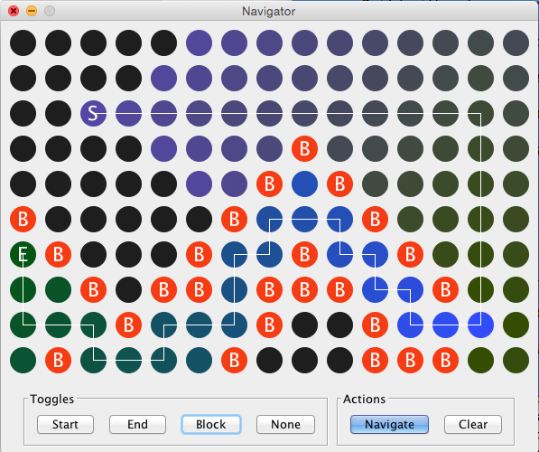
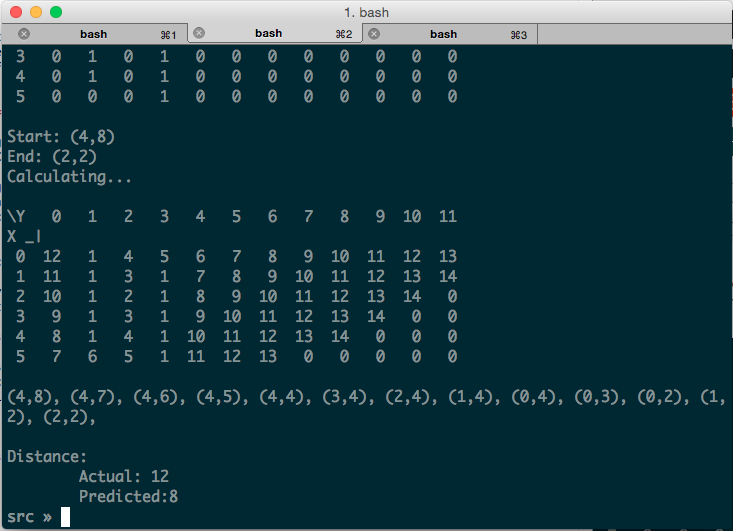

# Navigator - A Wavefront Pathfinder
## Overview

Navigator is a pathfinding app that uses the Wavefront algorithm to find a path between two points on a 2D grid while taking obstacles into account.

The app consists of two parts, a pathfinding library and a GUI.

**Library**:

* Node.java - A node in the grid that knows it's neighbors.
* Point2D.java - A 2D coordinate of a point on the grid.
* LinkedGrid.java - A grid of nodes.
* PathFinder.java - The implementation of the Wavefront algorithm that utilizes the linked grid.

**GUI**

* Navigator.java - The main code for the GUI.
* GridCanvas.java - The code for drawing the grid.

## Usage
1. Create a LinkedGrid of size x by y.
2. Block any nodes by setting them to `LinkedGrid.BLOCKED`.
3. Use the grid and endpoints to create a PathFinder object and get a path.

## Building
To compile both packages, from the `src` directory, run the following in a terminal:

    javac com/syedraza/WaveFront/PathFinder.java
    javac com/syedraza/Navigator/Navigator.java

To create a JAR file for WaveFront:

    jar cf com/syedraza/WaveFront/*class

To create a JAR file for the Navigator:

    jar cfm "Navigator.jar" Manifest.txt com/syedraza/*/*class

## Function

The Navigator app demonstrates the usage of the library, and the `main()` method of the PathFinder class demonstrates a text-only representation.

In the GUI, black spaces are nodes that haven't been filled in. The colors represent the distance of the node from the end  point. 'S' represents the start point, 'E' the end point, and 'B' all blocked points. The toggle buttons allow toggling these labels. The navigate button fills in the grid and shows a path. The clear button resets the grid.

The textual representation of the grid shows the actual coordinates and values of each node. The X and Y axes are labeled accordingly. '0' represents an unfilled node, and '1' represents a blocked node. The text implementation also shows the difference between the distance calculated naively and the actual distance due to blocked nodes.
