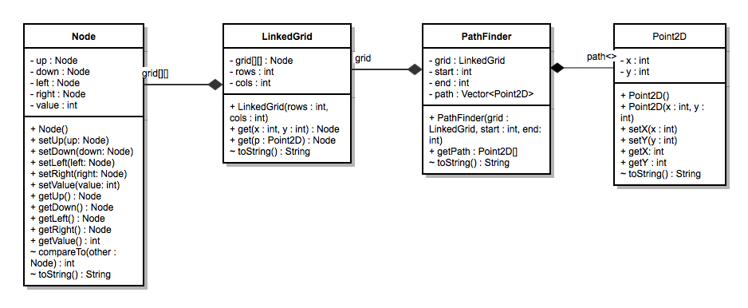

# Creating a Navigation App

For my honors project, I was to develop an API for path navigation in a 2D world and to create a GUI to use the API. The algorithm chosen was the Wavefront algorithm, which gets its name from how it functions. 

## Planning

The professor explained how the algorithm works to me and I bounced implementation ideas off of him. The setup I decided on was to use a grid of nodes, with each node linked to the other to allow easy traversal and so I wouldn't have to manage neighbors at the grid level. The resulting UML diagram can be seen below.

As I implemented the nodes and the linked grid, I started thinking about the path finder itself. Dealing with specific x and y coordinates was becoming cumbersome so I created a Point2D object to represent them, especially since the path finder needed to return a path.

## Function

The library works as follows: First a linked grid of a specified size is created, which links neighboring nodes together. The grid, along with start and end points is passed to a PathFinder object which runs the wavefront algorithm and returns a calculated path. The pathfinder starts at the end point, and fills in neighboring nodes with higher and higher values as it gets closer to the starting point. Blocked nodes are filled with a reserved value and can't be passed. Then, the algorithm starts at the start point and naively traverses the grid, creating a path from the first lowest-value neighbor found. An exception is thrown if the end point is unreachable. 

When I created the GUI, I realized the need for extra functionality in my library, because as it was, each linked grid and path finder were single use. I implemented a function to reset a linked grid to default values so nodes wouldn't have to be constantly relinked. I also noticed that the wavefront algorithm could reuse a prefilled grid as long as the end point wasn't changed and the start point was in the region filled in, but I decided it wasn't worth the complexity since it is usually end points that are changed and not start points.

The GUI uses a fixed-size grid and allows users to place start, end, and blocked points. When they click "Navigate", a path is found or a popup informs them if the end is unreachable. A path is drawn from the start to the end and nodes are colored according to their filled-in values that correspond to their distance from the end point.

## Issues
One of the biggest limitations of the Wavefront algorithm is that it doesn't scale well to larger grids. I was forced to use a fixed-size grid because filling in larger grids would take an enormous amount of time and CPU power. (It would be at 100% usage)

Another issue I encountered at first when implementing the Wavefront algorithm recursively was that nodes weren't being filled in like a 'wave', but by the first neighbor found since the recursive implementation just moves to the first node found and only comes back to it's neighbors after the stack unwinds. After discussion with my professor, I learned that this was because I was employing a depth-first search instead of a breadth-first search. The Wavefront algorithm creates a tree starting from the end node, with it's four neighbors as children, and each child having it's own neighbors. I was only going from a parent to it's child instead of all the neighbors at the same level. I fixed this issue by using a queue, where a node was pushed, and when it was popped, all of it's neighbors were  pushed at the end.

For the GUI, any time a user navigates the grid and tries to place a new point, I reset the grid. I ran into a lot of corner cases here because many times the grid wouldn't be reset, or the changes wouldn't show. This lead to a lot of complex logic around resetting since I didn't want the user to lose points they previously blocked as well as start and end points. The coloring can also be misleading since I used RGB colors, and many times the values would exceed the threshold of 255 so instead of a smooth gradient, the user can see two separate gradients suddenly splitting.

## Improvements
There are quite a few areas that could be improved in a future iteration of the application. The biggest improvement in terms of user experience would be to implement a drag-and-drop interface using AWT's `dnd` library. Another improvement would be to calculate the path in a separate thread and to show a loading indicator since the pathfinding can take a long time. Another consideration would be to try to avoid turning as much as possible, since that's how real-life actors prefer to move. (The implementation of that would be simple since all we'd have to do is try to move in the same direction as a previous move) Lastly the color indicators could be made more useful by taking advantage of the larger range provided by hexadecimal colors.

## References
* [Wavefront Planning Algorithm - Tufts University](http://www.cs.tufts.edu/comp/150IR/labs/wavefront.html)
* [Wavefront Algorithm - Society of Robots](http://www.societyofrobots.com/programming_wavefront.shtml)
